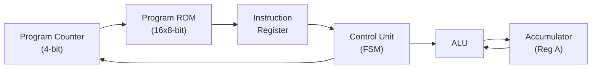
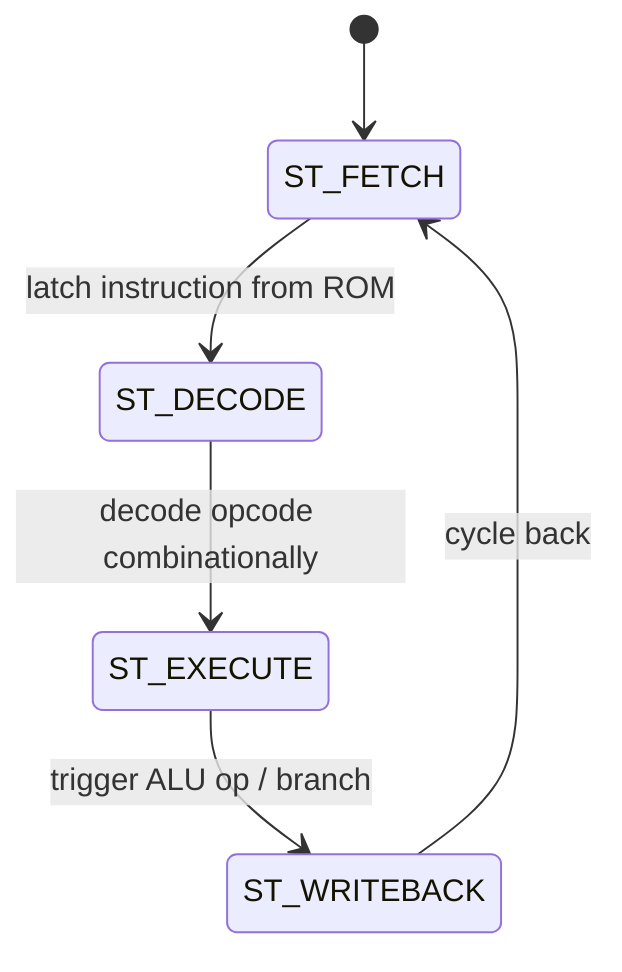

# 8-Bit Custom Mini CPU (VHDL)

A custom, accumulator-based 8-bit microcontroller implemented in VHDL, featuring a hand-designed Instruction Set Architecture (ISA), an integrated ALU, and a Moore-style FSM control unit. Synthesized for a Xilinx Spartan-6 FPGA and verified using Xilinx ISim.

---

## Why This Project

Most student CPU projects use an off-the-shelf ISA. Here, I designed the instruction format, opcode map, and control FSM from scratch to understand how a real control unit sequences fetch, decode, execute, and writeback — the same principles used in production microcontroller cores.

---

## Architecture Overview

| Block | Description |
|---|---|
| Program Counter (PC) | 4-bit register, addresses up to 16 memory locations |
| Accumulator (Reg A) | 8-bit general-purpose data register |
| Program Memory (ROM) | 16×8-bit distributed RAM, hardcoded instructions |
| Control Unit | Moore FSM driving the 4-stage pipeline below |

### Block Diagram



### Control Unit FSM



---

## Instruction Set Architecture (ISA)

8-bit instruction word: upper 4 bits = Opcode, lower 4 bits = Immediate Operand.

| Opcode (Binary) | Mnemonic | Description |
|---|---|---|
| `0001` | **LOAD** | Loads 4-bit immediate into the Accumulator |
| `0010` | **ADD** | Adds 4-bit immediate to the Accumulator |
| `0011` | **SUB** | Subtracts 4-bit immediate from the Accumulator |
| `0100` | **JUMP** | Sets PC to the 4-bit immediate address |

### Test Program Execution

| Step | Instruction | Binary | Effect |
|---|---|---|---|
| 1 | `LOAD 5` | `0001 0101` | Reg A = 5 |
| 2 | `ADD 3` | `0010 0011` | Reg A = 8 |
| 3 | `SUB 2` | `0011 0010` | Reg A = 6 |
| 4 | `JUMP 1` | `0100 0001` | PC → Address 1 (loops to `ADD 3`) |

This creates an infinite loop that cycles Reg A through 8 → 6 → 9 → 7..., useful for verifying ALU and branch logic together.

---

## Simulation Waveforms

Verified with an ISim testbench: 100ns reset followed by standard clock cycles.

**Full execution cycle (Fetch → Decode → Execute → Writeback):**


*Add your screenshot here: shows clk, rst, PC, IR, state, and ACC across one full FSM cycle*

**ALU operation detail (ADD/SUB):**


*Add your screenshot here: zoomed-in view of ACC value changing during ADD 3 → SUB 2*

> Place your screenshots in a `waveform/` folder and update the paths above to match your filenames.

---

## Synthesis Results

Synthesized using Xilinx ISE 14.7.

| Metric | Value |
|---|---|
| Target Device | Xilinx Spartan-6 (`xc6slx9-2-csg324`) |
| Max Clock Frequency | 173.4 MHz (5.767 ns min period) |
| Slice Registers (FFs) | 47 |
| Slice LUTs | 78 |
| Distributed RAM | 1 × 16×8-bit |

---

## Repository Structure

├── hardware/    # Constraint files, board-specific configs

├── sim/         # Testbenches and simulation scripts

├── src/         # VHDL source (CPU, ALU, control unit, ROM)

├── synth/       # Synthesis reports and netlists

└── README.md

---

## How to Run

```bash
# Simulation (ISim / GHDL)
ghdl -a src/*.vhd
ghdl -e cpu_top
ghdl -r cpu_top --vcd=wave.vcd
gtkwave wave.vcd

# Synthesis (Xilinx ISE)
# Open synth/ project file in ISE, run "Synthesize - XST"
```

---

## What I'd Improve Next

- Add conditional branching (currently only unconditional JUMP)
- Expand ISA with logical ops (AND, OR, NOT)
- Pipeline fetch/decode to improve throughput
- Port to a more modern FPGA toolchain (Vivado) for newer boards

---

## Author

**Vivek Rai** — Electronics & Telecommunication Engineering, TSEC Mumbai
Interests: Digital Design · FPGA · Computer Architecture · VLSI
